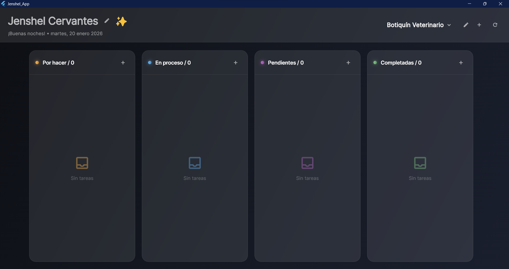

# Jenshel App - Personal Kanban Workflow Engine

[](https://www.gnu.org/licenses/gpl-3.0)

A **Local-First Kanban App** that prioritizes user data privacy and instant performance. This **Serverless Task Manager** operates entirely on your device, ensuring your tasks never leave your computer. As a **Privacy-Centric Taskboard**, it provides a secure, offline-first experience for managing workflows. Built as an **Open-Source Productivity Tool**, it embodies the spirit of **Minimalist Workflow Engine** – simple, powerful, and ready to use without any setup.



## 🌟 Key Features

- **Local-First Architecture**: All data stored locally using Isar database – no cloud, no servers, instant access.
- **Multi-Project Support**: Organize tasks across multiple projects with isolated Kanban boards.
- **Drag-and-Drop Kanban**: Intuitive task management with smooth drag-and-drop between columns (To Do, In Progress, Done).
- **Glassmorphism UI**: Premium visual design with glass effects, gradients, and responsive animations.
- **Privacy by Design**: Zero data collection, no internet required, complete user control.
- **Cross-Platform**: Built with Flutter for Windows, macOS, Linux, and mobile devices.
- **Offline-First**: Works seamlessly without network connectivity.

## 🚀 Quick Start

### Prerequisites
- [Flutter](https://flutter.dev/docs/get-started/install) (version 3.9.2 or later)
- Dart SDK (included with Flutter)

### Installation

1. **Clone the repository**:
   ```bash
   git clone https://github.com/Jenshel/Kanban-Workflow.git

   cd Kanban-Workflow
   ```

2. **Install dependencies**:
   ```bash
   flutter pub get
   ```

3. **Run the app**:
   ```bash
   flutter run
   ```

That's it! The app launches instantly with no additional configuration required.

## 📖 Usage

### Getting Started
1. **Launch the app** - No login or registration needed.
2. **Create your first project** - Click the project selector to add a new project.
3. **Add tasks** - Use the "+" button in any column to create tasks.
4. **Organize workflow** - Drag tasks between columns: To Do → In Progress → Done.

### Features Overview
- **Editable App Title**: Click the pencil icon to customize the app title.
- **Project Management**: Switch between projects using the dropdown selector.
- **Task Details**: Click any task card to view/edit details, set priority, and assign columns.
- **Responsive Design**: Adapts beautifully to different screen sizes.

## 🏗️ Architecture

### Local-First Design
- **Isar Database**: High-performance NoSQL database for local storage.
- **No External Dependencies**: Operates entirely offline.
- **Instant Performance**: Data operations are immediate, no network latency.

### Technology Stack
- **Flutter**: Cross-platform UI framework
- **Dart**: Programming language
- **Isar**: Local database for task storage
- **Shared Preferences**: Local settings storage
- **Material Design**: UI components with custom theming

### Data Model
- **Tasks**: Title, description, priority, column, project association
- **Projects**: Isolated task containers
- **Settings**: App title, project list

## 🤝 Contributing

We welcome contributions! This is an open-source project built for the community.

### How to Contribute
1. Fork the repository
2. Create a feature branch (`git checkout -b feature/amazing-feature`)
3. Commit your changes (`git commit -m 'Add amazing feature'`)
4. Push to the branch (`git push origin feature/amazing-feature`)
5. Open a Pull Request

### Development Setup
```bash
# After cloning and installing dependencies
flutter run  # For development
flutter test  # Run tests
flutter build windows  # Build for Windows
```

## 📄 License

This project is licensed under the GNU General Public License v3.0 - see the [LICENSE](LICENSE) file for details.

The GPL v3 ensures that:
- The software remains free and open-source
- Users have the freedom to run, study, share, and modify the code
- Any derivative works must also be licensed under GPL v3

## 🙏 Acknowledgments

- Built with ❤️ using Flutter
- Inspired by the principles of local-first software
- Thanks to the open-source community for amazing tools like Isar and Flutter

## 📞 Support

- **Issues**: [GitHub Issues](https://github.com/Jenshel/Kanban-Workflow/issues)
- **Discussions**: [GitHub Discussions](https://github.com/Jenshel/Kanban-Workflow/discussions)

---

**Jenshel App** - Your personal, private, powerful Kanban workflow engine. No servers, no subscriptions, just productivity.
